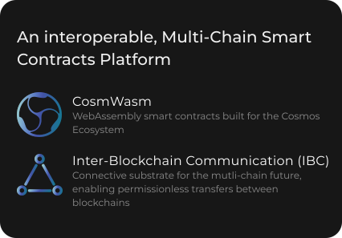
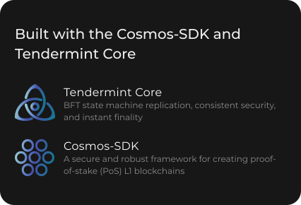

# ✨ About Nibiru

A comprehensive guide on understanding the Nibiru Ecosystem. {synopsis}

**Nibiru** is a sovereign proof-of-stake blockchain, open-source platform, and member of a family of interconnected blockchains that comprise the Cosmos Ecosystem.

Nibiru unifies leveraged derivatives trading, spot trading, staking, and bonded liquidity provision into a seamless user experience, enabling users of over 40 blockchains to trade with leverage using a suite of composable decentralized applications.

## Nibiru Ecosystem

### [Nibi-Perps](../ecosystem/nibi-perps)

A perpetual futures exchange where users can take leveraged exposure and trade on a plethora of assets — completely on-chain, completely non-custodially, and with minimal gas fees.

### [Nibi-Swap AMM](../ecosystem/nibi-swap)

**Nibi-Swap** is an automated market maker protocol for multichain assets. This application gives users access to swaps, pools, and bonded liquidity gauges.

### [NUSD Stablecoin](../ecosystem/nusd-stablecoin)

Nibiru powers a two-token economic model, where NIBI is the staking and utility token for the protocol and NUSD is a capital-efficient, partially collateralized stablecoin for the protocol.

### [Price Feed Oracles](../ecosystem/price-feed-oracles)

Nibiru accurately prices assets using a native, system of decentralized [oracles](content/price-feed-oracles.md), and communicates with other Cosmos layer-1 chains using the [Inter-Blockchain Communication (IBC)](https://github.com/cosmos/ibc) protocol.

***

### CosmWasm Integration

Nibiru will also act as a permission-less and censorship resistant platform for developers to deploy smart contracts in Go and Rust.

### Inter-Blockchain Communication Protocol (IBC)

Nibiru is IBC compliant at genesis and connected over 40 blockchains. IBC enables secure and permissionless transfers of funds between blockchains in addition to cross-chain computation and transfer of arbitrary data. This includes cross-chain smart contract calls, fee payments, NFTs, and fungible token transfers. IBC is not reliant on a multi-sig or centralized bridging solution.

The security of the Nibiru blockchain relies on a set of validators to commit new blocks and participate in Tendermint BFT consensus by brodcasting votes that contain cryptographic signatures signed by each validator's private key. Validators stake **NIBI**, the protocol's native token used for gas, governance, and "mining". Users can delegate NIBI to validators that record and verify transactions in exchange for rewards.

### [Frequently Asked Questions (FAQ)](./faq)

### Contribution guidelines for this documentation

You can contribute to improve this documentation by submitting a [GitHub](https://github.com/NibiruChain/docs) issue or opening a pull request.
